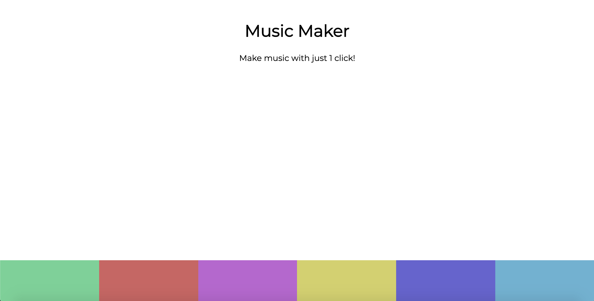

# Music-App
https://bbrier14.github.io/Music-App/
## Overview
The Music Maker App is a vanilla Javascript application that allows the user to make music by clicking on a keyboard.
## How it Works
The user simply clicks on any one of six different keys to make different sounds. The user can click the sounds as much as they want. Every time a button is pressed, a small animtion initiates.
## Technologies Used
HTML5, CSS3, Javascript, and some short MP3's.
## Role
This is a solo project.
## Screenshots

